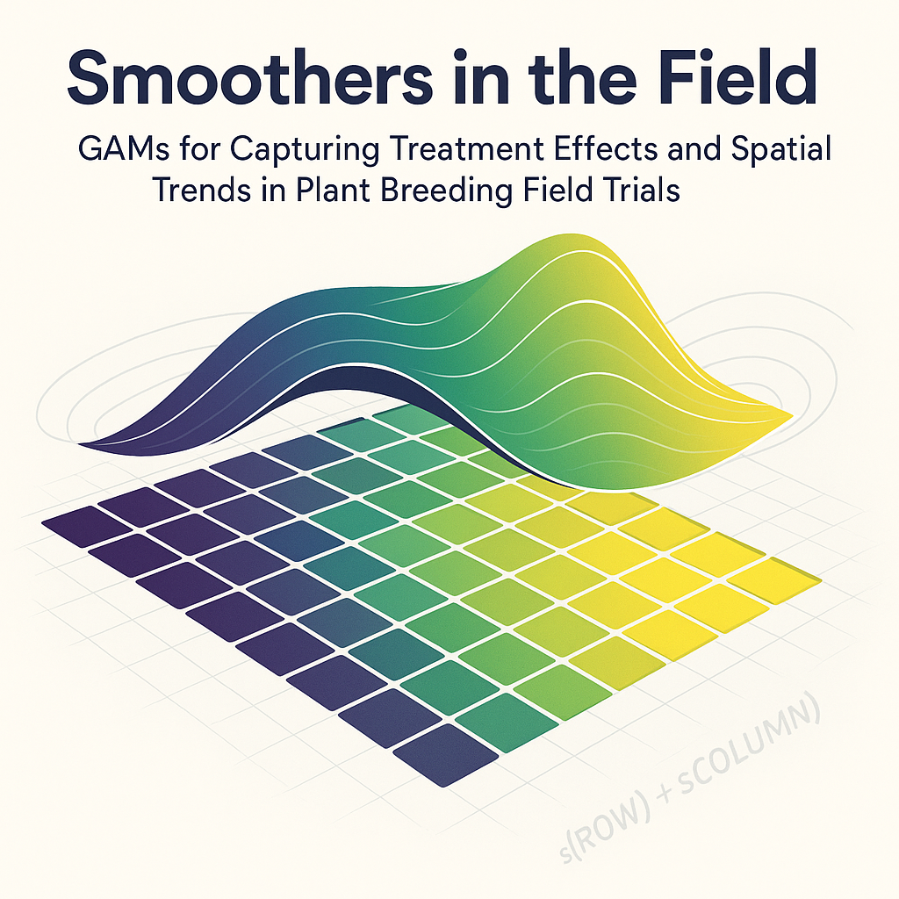

```{r setup, include=FALSE, comment=NA}
knitr::opts_chunk$set(
  echo = TRUE,
  warning = FALSE,
  message = FALSE,
  comment = NA
)
```




```{r, echo=FALSE, eval=TRUE, warning=FALSE, comment=NA, include=FALSE}
suppressMessages({
  suppressWarnings({
    library(mgcv)
    library(asreml)
    library(dplyr)
    library(tidyr)
    library(ggplot2)
    library(patchwork)
    library(kableExtra)
    library(viridis)
  })
})
```

```{r, echo=FALSE, eval=TRUE, warning=FALSE, comment=NA}
my_theme <- theme_minimal(base_size = 13) +
  theme(
    plot.title = element_text(face = "bold", hjust = 0.5),
    axis.title.x = element_text(size = 12, margin = margin(t = 8)),
    axis.title.y = element_text(size = 12, margin = margin(r = 8)),
    axis.text.x  = element_text(size = 8, angle = 90, vjust = 0.5, hjust = 1),
    axis.text.y  = element_text(size = 8),
    legend.position = "top",
    legend.title = element_text(size = 11),
    legend.text = element_text(size = 10),
    panel.grid.major = element_blank(),
    panel.grid.minor = element_blank()
  )
```


### Introduction

Agricultural field trials are essential for evaluating genotype performance across diverse environments in plant breeding. Yet spatial trends—driven by soil variability, irrigation, or microclimatic gradients—often introduce noise that can obscure the true genetic signal. Traditional linear mixed models have long been the standard approach for accounting for this spatial structure while estimating treatment effects.

Generalized Additive Models (GAMs) offer a flexible, non-parametric alternative capable of modeling smooth spatial surfaces and complex field patterns. Despite their strong theoretical appeal, GAMs remain underutilized in plant breeding applications. In this article, we explore how GAMs can be applied to field trial data and compare their performance to a classical spatial mixed model built using ASReml. We focus on model-fit diagnostics, spatial trend capture, and agreement in genotype rankings—measured using correlation and Kendall's tau—to assess their utility in modern breeding experiments.

### Data

The dataset originates from a simulation study based on a partially replicated (p-rep) field trial design, involving 180 genotypes (treatments) evaluated across five environments. For the purposes of this article, we focus on a single environment to illustrate a within-location spatial analysis. The dataset includes field layout information (row and column positions), genotype identifiers (treatments), and grain yield as the primary response variable.

Note: Throughout this article, we use the terms genotype and treatment interchangeably. Each treatment corresponds to a unique genotype evaluated in the field trial.

```{r,echo=FALSE}
# Load and prepare data
yield_data <- read.csv("FARGO_pREP_2025-04-18.csv")

yield_data_single_gam <- yield_data |>
	filter(LOCATION == "LOC1") |>
	mutate(
		TREATMENT  = as.factor(TREATMENT),
		ROW_fc     = as.factor(ROW),
		COLUMN_fc  = as.factor(COLUMN)
	) |>
	arrange(ROW, COLUMN) |>
	group_by(ROW) |>
	mutate(AR_start = row_number() == 1) |>
	ungroup()
```

```{r, echo=FALSE, eval=TRUE, comment=NA}
head(yield_data) |> kable()
```

### Basic GAM Model

In a GAM model, we replace strictly linear terms with smooth functions estimated from the data. For example, instead of assuming a linear relationship between yield and row, we estimate a smooth function $f_1(ROW)$. The goal is to capture subtle trends in the field that would otherwise be modeled as random effects or spatial residuals.

#### Model Equation:

We begin with a model for the yield $y_{ijk}$ at each plot $(i,j)$ with treatment $k$:

<div style="font-size: 80%">
$$YIELD = f_1(ROW) + f_2(COLUMN) + f_3(ROW_{fc}) + f_4(COLUMN_{fc}) + f_5(TREATMENT)$$
</div>

Where:

- $f_1$ and $f_2$ are smooth spatial trends modeled with penalized splines (bs = "ps")

- $f_3$ and $f_4$ are random row and column effects (bs = "re")

- $f_5$ is the treatment random effect (bs = "re")

The model is fitted using the `bam()` function from the `mgcv` package:

```{r, echo=TRUE}
gam_m1 <- bam(
	YIELD ~ 
		s(ROW, bs = "ps") + s(COLUMN, bs = "ps") +
		s(ROW_fc, bs = "re") + s(COLUMN_fc, bs = "re") +
		s(TREATMENT, bs = "re"),
	data = yield_data_single_gam,
	method = "fREML"
)
```

#### Genotype-Level Predictions

To extract genotype-level predictions from the model, we predict treatment effects while fixing all spatial covariates at their field-centered values. The way we created the `newdata` set for GAM model prediction, as shown below:

```{r, echo=TRUE, eval=TRUE, comment=NA}
# Center values for marginal prediction
mean_row <- mean(yield_data_single_gam$ROW)
mean_column <- mean(yield_data_single_gam$COLUMN)
row_fc_center <- as.factor(mean_row)
col_fc_center <- as.factor(mean_column)

# Generate prediction dataset
newdata_gam <- tibble::tibble(
	TREATMENT = levels(yield_data_single_gam$TREATMENT),
	ROW = mean_row,
	COLUMN = mean_column,
	ROW_fc = row_fc_center,
	COLUMN_fc = col_fc_center
)
```

```{r, echo=FALSE, eval=TRUE, comment=NA}
# Add confidence intervals
add_confidence_intervals <- function(tbl, pred_col, se_col, level = 0.95) {
  z <- qnorm(1 - (1 - level) / 2)
  tbl |>
    mutate(
      lower = {{ pred_col }} - z * {{ se_col }},
      upper = {{ pred_col }} + z * {{ se_col }}
    )
}
```

Then we use the dataset `newdata_gam` to predict based on the GAM model.

```{r, echo=TRUE, eval=TRUE, comment=NA}
preds_treatment <- predict(gam_m1, newdata = newdata_gam, se.fit = TRUE, type = "response")

BLUPs_gam_single <- newdata_gam |>
	mutate(
		predicted_value = preds_treatment$fit,
		se = preds_treatment$se.fit
	) |>
	add_confidence_intervals(pred_col = predicted_value, se_col = se) |> 
	select(TREATMENT, predicted_value, se, lower, upper)
```

These predictions include the predicted yield for each genotype, associated standard errors, and 95% confidence intervals.

```{r echo=FALSE, eval=TRUE, comment=NA}
BLUPs_gam_single |> head(10) |> kable()
```


### Basic ASReml Model

To evaluate the GAM approach in context, we fit a traditional linear mixed model using the ASReml package. This model includes fixed effects for field layout (ROW and COLUMN), along with smooth spatial trends (`spl()`) and random effects for genotype (`TREATMENT`). The model setup mirrors the structure used in the GAM, allowing for a fair comparison of best linear unbiased predictions (BLUPs) and spatial adjustment.

```{r, echo=FALSE, eval=TRUE}
yield_data_single_asreml <- yield_data_single_gam |> 
	arrange(ROW_fc, COLUMN_fc)
```

The equivalent Mixed model using the R package `ASReml` is 

```{r asreml_model0, eval=FALSE, echo=TRUE, message=FALSE, warning=FALSE}
asreml_m1 <- asreml(
	fixed = YIELD ~ ROW + COLUMN,
	random = ~ spl(ROW) + spl(COLUMN) + TREATMENT,
	data = yield_data_single_asreml,
	trace = FALSE
)

asreml_m1 <- update(asreml_m1)
```


```{r asreml_model1, eval=TRUE, echo=FALSE, message=FALSE, warning=FALSE, results='hide', include=FALSE}
suppressMessages({
  suppressWarnings({
			asreml_m1 <- asreml(
				fixed = YIELD ~ ROW + COLUMN,
				random = ~ spl(ROW) + spl(COLUMN) + TREATMENT,
				data = yield_data_single_asreml,
				trace = FALSE
			)
			
			asreml_m1 <- update(asreml_m1)
			
			pred_asreml <- predict(asreml_m1, classify = "TREATMENT", sed = TRUE)$pvals
  })
})
```

#### Genotype-Level Predictions - ASReml

Once the ASReml model is fitted, extracting the predicted genotype is straightforward using the `predict()` function. We augmented the predictions with 95% confidence intervals based on the standard errors:

```{r, eval=FALSE, echo=TRUE, message=FALSE, warning=FALSE, results='hide'}
pred_asreml <- predict(asreml_m1, classify = "TREATMENT", sed = TRUE)$pvals
pred_asreml |> 
	add_confidence_intervals(pred_col = predicted.value, se_col = std.error)
```


```{r, eval=TRUE, echo=FALSE}
pred_asreml |> 
	add_confidence_intervals(pred_col = predicted.value, se_col = std.error) |> 
	head(10) |> 
	kable()
```

### Model fit diagnostics

To assess how well each model captures spatial variation and explains yield variability, we begin by examining standard diagnostic plots. These include residual histograms, residuals versus fitted values, and QQ-plots. The following figure how these plot for the GAM model fitted in the previous section.

```{r, fig.align="c", fig.width=11, fig.height=3.5, echo=FALSE, eval=TRUE}
# Residuals for model fit check
yield_data_gam_res <- yield_data_single_gam |>
	mutate(
		fitted = predict(gam_m1, type = "response"),
		residual = residuals(gam_m1, type = "response")
	)

# Histogram of Residuals
hist_plot <- ggplot(yield_data_gam_res, aes(x = residual)) +
	geom_histogram(binwidth = 0.3, fill = "steelblue", color = "black") +
	labs(
		title = "Histogram of Residuals (GAM)",
		x = "Residual",
		y = "Frequency"
	) +
	theme_minimal(base_size = 10)

# Residuals vs Fitted
resid_fit_plot <- ggplot(yield_data_gam_res, aes(x = fitted, y = residual)) +
	geom_point(alpha = 0.8, color = "black") +
	geom_smooth(method = "loess", se = FALSE, color = "red", linewidth = 0.8) +
	labs(
		x = "Fitted Values",
		y = "Residuals",
		title = "Residuals vs Fitted Values (GAM)"
	) +
	theme_minimal(base_size = 10)

# QQ Plot
qq_plot <- ggplot(yield_data_gam_res, aes(sample = residual)) +
	stat_qq(color = "darkgreen") +
	stat_qq_line(color = "black", linewidth = 0.8) +
	labs(
		title = "QQ Plot of Residuals (GAM)",
		x = "Theoretical Quantiles",
		y = "Sample Quantiles"
	) +
	theme_minimal(base_size = 10)

# Arrange in 2x2 grid (fourth empty)
(hist_plot | resid_fit_plot | qq_plot)
```

In parallel, we examine the diagnostic plots for the ASReml-fitted linear mixed model.

```{r, fig.align="c", fig.width=11, fig.height=3.5, echo=FALSE, eval=TRUE}
# Residuals for model fit check
yield_data_single_asreml_res <- yield_data_single_asreml |>
	dplyr::mutate(
		fitted = fitted(asreml_m1),
		residual = residuals(asreml_m1, type = "response")
	)

# Histogram of Residuals
hist_plot <- ggplot(yield_data_single_asreml_res, aes(x = residual)) +
	geom_histogram(binwidth = 0.3, fill = "steelblue", color = "black") +
	labs(
		title = "Histogram of Residuals (ASReml)",
		x = "Residual",
		y = "Frequency"
	) +
	theme_minimal(base_size = 10)

# Residuals vs Fitted
resid_fit_plot <- ggplot(yield_data_single_asreml_res, aes(x = fitted, y = residual)) +
	geom_point(alpha = 0.8, color = "black") +
	geom_smooth(method = "loess", se = FALSE, color = "red", linewidth = 0.8) +
	labs(
		x = "Fitted Values",
		y = "Residuals",
		title = "Residuals vs Fitted Values (ASReml)"
	) +
	theme_minimal(base_size = 10)

# QQ Plot
qq_plot <- ggplot(yield_data_single_asreml_res, aes(sample = residual)) +
	stat_qq(color = "darkgreen") +
	stat_qq_line(color = "black", linewidth = 0.8) +
	labs(
		title = "QQ Plot of Residuals (ASreml)",
		x = "Theoretical Quantiles",
		y = "Sample Quantiles"
	) +
	theme_minimal(base_size = 10)

# Arrange in 2x2 grid (fourth empty)
(hist_plot | resid_fit_plot | qq_plot)
```

The diagnostic plots for both the GAM and ASReml models show some clear issues. In the fitted values vs residuals, we observe clustering of residuals, which likely reflect residual correlation among spatially adjacent plots. This pattern suggests that the current models have not fully accounted for spatial dependence in the errors. The QQ plots show deviations from normality, especially in the tails, and the histograms reveal slight skewness. These patterns point to remaining spatial variation or structure not yet modeled, indicating room for improvement in both approaches.

### Improving the GAM Model

To further evaluate the flexibility of Generalized Additive Models, we introduced a more complex spatial structure into the model. The objective here is to better capture residual spatial trends and improve model fit. While `ASReml` supports two-dimensional autoregressive residual structures (`AR1 ⊗ AR1`), the `mgcv` package in R only supports autoregressive modeling along a single dimension. To compensate for this limitation, we included a tensor product smoother between rows and columns using random effect bases (`bs = "re"`). This tensor interaction term acts like a spatial nugget, allowing us to capture localized deviations not explained by marginal row or column effects.

Additionally, we modeled residual correlation along the row dimension using an `AR(1)` structure. Since `mgcv::bam()` requires the autocorrelation parameter `rho` to be manually specified, we estimated it via a grid search and found the best-performing value to be `rho = 0.55`.

The upgraded GAM model can be expressed as

<div style="font-size: 80%">
$$YIELD = f_1(ROW) + f_2(COLUMN) + f_3(ROW_{fc}) + f_4(COLUMN_{fc}) + f_5(TREATMENT) +$$
$$f_6(ROW_{fc}, COLUMN_{fc})$$
</div>
Where:

- $f_6$ is the tensor product within Rows and Columns with random effects (bs = "re") for both factors.

The GAM model is specified as follows:

```{r}
gam_m2 <- bam(
	YIELD ~ 
		s(ROW, bs = "ps") + s(COLUMN, bs = "ps") +
		s(ROW_fc, bs = "re") + s(COLUMN_fc, bs = "re") +
		s(TREATMENT, bs = "re") +
		te(ROW_fc, COLUMN_fc, bs = c("re", "re")),
	rho = 0.55,
	AR.start = yield_data_single_gam$AR_start,
	data = yield_data_single_gam,
	method = "fREML"
)
```

The upgraded GAM model predictions are summarized below.

```{r, comment=NA, eval=TRUE, echo=TRUE, message=FALSE, warning=FALSE}
preds_treatment <- predict(gam_m2, newdata = newdata_gam, se.fit = TRUE, type = "response")

BLUPs_gam_single2 <- newdata_gam |>
	mutate(
		predicted_value = preds_treatment$fit,
		se = preds_treatment$se.fit
	) |>
	add_confidence_intervals(pred_col = predicted_value, se_col = se)|> 
	select(TREATMENT, predicted_value, se, lower, upper) 
```

```{r comment=NA, eval=TRUE, echo=FALSE, message=FALSE, warning=FALSE}
BLUPs_gam_single2 |> 
	head(10) |> 
	kable()
```

### Fully Spatial ASReml Model

To take full advantage of ASReml’s capabilities for modeling spatial correlation, we extended the previous model by specifying a two-dimensional autoregressive (`AR1 ⊗ AR1`) residual structure. This approach allows the model to directly account for residual dependencies across both rows and columns of the field layout. This is one of `ASReml’s` key strengths.

```{r asreml_model02, eval=FALSE, echo=TRUE, message=FALSE, warning=FALSE}
asreml_m2 <- asreml(
	fixed = YIELD ~ ROW + COLUMN,
	random = ~ spl(ROW) + spl(COLUMN) + TREATMENT,
	residual = ~ ar1(ROW_fc):ar1(COLUMN_fc),
	data = yield_data_single_asreml,
	trace = FALSE
)

asreml_m2 <- update(asreml_m2)
```


```{r asreml_model12, eval=TRUE, echo=FALSE, message=FALSE, warning=FALSE, include=FALSE}
suppressMessages({
  suppressWarnings({
			asreml_m2 <- asreml(
				fixed = YIELD ~ ROW + COLUMN,
				random = ~ spl(ROW) + spl(COLUMN) + TREATMENT,
				residual = ~ ar1(ROW_fc):ar1(COLUMN_fc),
				data = yield_data_single_asreml,
				trace = FALSE
			)
			
			asreml_m2 <- update(asreml_m2)
			pred_asreml2 <- predict(asreml_m2, classify = "TREATMENT", sed = TRUE)$pvals
  })
})
```

#### Genotype-Level Predictions - ASReml

The updated ASReml linear mixed model predictions are:

```{r, eval=FALSE, echo=TRUE, message=FALSE, warning=FALSE, results='hide'}
pred_asreml2 <- predict(asreml_m2, classify = "TREATMENT", sed = TRUE)$pvals
pred_asreml2 |> 
	add_confidence_intervals(pred_col = predicted.value, se_col = std.error)
```


```{r, eval=TRUE, echo=FALSE}
pred_asreml2 |> 
	add_confidence_intervals(pred_col = predicted.value, se_col = std.error) |> 
	head(10) |> 
	kable()
```

### Model fit diagnostics

Let us check the new models result diagnostics. The following figure shows the residual histograms, fitted values vs residuals, and QQ-plots for the GAM model.

```{r, fig.align="c", fig.width=11, fig.height=3.5, echo=FALSE, eval=TRUE}
# Residuals for model fit check
yield_data_gam_res2 <- yield_data_single_gam |>
	mutate(
		fitted = predict(gam_m2, type = "response"),
		residual = residuals(gam_m2, type = "response")
	)

# Histogram of Residuals
hist_plot <- ggplot(yield_data_gam_res2, aes(x = residual)) +
	geom_histogram(binwidth = 0.3, fill = "steelblue", color = "black") +
	labs(
		title = "Histogram of Residuals (GAM)",
		x = "Residual",
		y = "Frequency"
	) +
	theme_minimal(base_size = 10)

# Residuals vs Fitted
resid_fit_plot <- ggplot(yield_data_gam_res2, aes(x = fitted, y = residual)) +
	geom_point(alpha = 0.8, color = "black") +
	geom_smooth(method = "loess", se = FALSE, color = "red", linewidth = 0.8) +
	labs(
		x = "Fitted Values",
		y = "Residuals",
		title = "Residuals vs Fitted Values (GAM)"
	) +
	theme_minimal(base_size = 10)

# QQ Plot
qq_plot <- ggplot(yield_data_gam_res2, aes(sample = residual)) +
	stat_qq(color = "darkgreen") +
	stat_qq_line(color = "black", linewidth = 0.8) +
	labs(
		title = "QQ Plot of Residuals (GAM)",
		x = "Theoretical Quantiles",
		y = "Sample Quantiles"
	) +
	theme_minimal(base_size = 10)

# Arrange in 2x2 grid (fourth empty)
(hist_plot | resid_fit_plot | qq_plot)
```

In the case of the ASReml model we have 

```{r, fig.align="c", fig.width=11, fig.height=3.5, echo=FALSE, eval=TRUE}
# Residuals for model fit check
yield_data_single_asreml_res2 <- yield_data_single_asreml |>
	dplyr::mutate(
		fitted = fitted(asreml_m2),
		residual = residuals(asreml_m2, type = "response")
	)

# Histogram of Residuals
hist_plot <- ggplot(yield_data_single_asreml_res2, aes(x = residual)) +
	geom_histogram(binwidth = 0.3, fill = "steelblue", color = "black") +
	labs(
		title = "Histogram of Residuals (ASReml)",
		x = "Residual",
		y = "Frequency"
	) +
	theme_minimal(base_size = 10)

# Residuals vs Fitted
resid_fit_plot <- ggplot(yield_data_single_asreml_res2, aes(x = fitted, y = residual)) +
	geom_point(alpha = 0.8, color = "black") +
	geom_smooth(method = "loess", se = FALSE, color = "red", linewidth = 0.8) +
	labs(
		x = "Fitted Values",
		y = "Residuals",
		title = "Residuals vs Fitted Values (ASReml)"
	) +
	theme_minimal(base_size = 10)

# QQ Plot
qq_plot <- ggplot(yield_data_single_asreml_res2, aes(sample = residual)) +
	stat_qq(color = "darkgreen") +
	stat_qq_line(color = "black", linewidth = 0.8) +
	labs(
		title = "QQ Plot of Residuals (ASReml)",
		x = "Theoretical Quantiles",
		y = "Sample Quantiles"
	) +
	theme_minimal(base_size = 10)

# Arrange in 2x2 grid (fourth empty)
(hist_plot | resid_fit_plot | qq_plot)
```


The new diagnostic plots show a substantial improvement in model fit for both ASReml and GAM compared to our earlier models.

- **Histograms of Residuals:** The residuals for both models are now more symmetrically distributed around zero, with no major skewness or multimodal patterns, suggesting better homoscedasticity.

- **Residuals vs Fitted Values:** The previously observed systematic pattern near the center has largely diminished. The residuals now appear randomly scattered around zero, indicating reduced overfitting and improved variance stabilization across the fitted range. The slight curvature in the LOESS line is minor and expected in spatial data but no longer indicates strong model misspecification.

- **QQ Plots:** Both models show closer adherence to the theoretical normal line, especially in the central part of the distribution. Some deviation remains in the tails, but the overall alignment supports the assumption of normally distributed residuals.

Together, these results suggest that incorporating spatial structure (modeling the residuals via (`AR1 ⊗ AR1`) in ASReml and tensor product + AR1 in GAM) significantly enhanced the models' ability to capture underlying field variability. Both models now provide a much more reliable basis for estimating treatment effects.

#### Residuals heatmap

To better understand the spatial structure of model residuals, we visualize them using field-layout heatmaps. Each tile represents a plot in the field, with colors indicating the magnitude and direction of residuals:

- Dark purple for large negative residuals (underestimation),

- Green for near-zero residuals (good fit)

- Yellow for large positive residuals (overestimation).

These heatmaps help us detect residual spatial trends not captured by the models, such as blocks or streaks of consistently high or low residuals, which may suggest remaining unmodeled spatial variation.

```{r, fig.align="c", fig.width=12, fig.height=5, echo=FALSE, eval=TRUE}
heatmat_gam <- ggplot(yield_data_gam_res2, aes(x = COLUMN, y = ROW, fill = residual)) +
	geom_tile(color = "white") +
	scale_fill_viridis(
		option = "viridis",  # blue → green → yellow
		name = "Residual",
		direction = 1
	) +
	scale_x_continuous(breaks = scales::pretty_breaks(n = 10)) +
	scale_y_continuous(breaks = scales::pretty_breaks(n = 10)) +
	labs(
		title = "Spatial Heatmap of Residuals (GAM)",
		x = "Column",
		y = "Row"
	) +
	theme_minimal(base_size = 13) +
	theme(
		plot.title = element_text(face = "bold", hjust = 0.5),
		legend.position = "right"
	)

heatmat_asreml <- ggplot(yield_data_single_asreml_res2, aes(x = COLUMN, y = ROW, fill = residual)) +
	geom_tile(color = "white") +
	scale_fill_viridis(
		option = "viridis",  # blue → green → yellow
		name = "Residual",
		direction = 1
	) +
	scale_x_continuous(breaks = scales::pretty_breaks(n = 10)) +
	scale_y_continuous(breaks = scales::pretty_breaks(n = 10)) +
	labs(
		title = "Spatial Heatmap of Residuals (ASReml)",
		x = "Column",
		y = "Row"
	) +
	theme_minimal(base_size = 13) +
	theme(
		plot.title = element_text(face = "bold", hjust = 0.5),
		legend.position = "right"
	)
# Combine plots with shared legend and better layout
(heatmat_gam | heatmat_asreml) +
  plot_layout(guides = "collect") &
  theme(legend.position = "right")
```

The residuals from the GAM model are mostly centered around zero, with only a few isolated high values, indicating that the spatial pattern was well captured. Similarly, the ASReml model demonstrates good residual control, with only a few small clusters, suggesting effective modeling of the spatial structure. Overall, both models exhibit a strong spatial fit, and the residual plots confirm the absence of major unmodeled patterns.

### Model Predictions: Correlation and Rankings

To assess the agreement between the two modeling approaches, we compare the predictions generated by the Generalized Additive Model (GAM) and the classical Linear Mixed Model (LMM) fitted using ASReml. We focus on both the correlation of predicted values and the consistency of genotype rankings, which are key aspects for selection decisions in breeding programs.

#### Correlation of Predicted Values

```{r comment=NA}
cor(BLUPs_gam_single2$predicted_value, pred_asreml2$predicted.value)
```

The correlation between predicted genotype values from the GAM and ASReml models is remarkably close to 1.0. This high degree of agreement suggests that, despite structural and distributional differences in the underlying models, both approaches yield very similar overall treatment effects. It reinforces the idea that GAM can serve as a robust method for spatial modeling in field trials.

#### Agreement in Genotype Rankings

Accurate genotype ranking is critical in plant breeding, as decisions about advancement, selection, and crossing often rely on identifying the top-performing entries. To assess this, we compare the overall rank correlation between the two models using `Kendall's tau`, a non-parametric metric that reflects the consistency of pairwise orderings.

```{r echo=TRUE, eval=TRUE, comment=NA}
# GAM ranks
rank_gam_total <- BLUPs_gam_single2 |>
	dplyr::select(TREATMENT, predicted_value) |>
	dplyr::mutate(rank_gam_total = rank(-predicted_value))

# ASReml ranks
rank_asreml <- pred_asreml2 |>
	dplyr::select(TREATMENT, predicted.value) |>
	dplyr::mutate(rank_asreml = rank(-predicted.value))

# Compare ranks
rank_comparison <- rank_gam_total |>
	dplyr::inner_join(rank_asreml, by = "TREATMENT") |>
	dplyr::mutate(diff = rank_gam_total - rank_asreml)
```

#### Kendall Correlation:

```{r}
cor(rank_comparison$rank_gam_total, rank_comparison$rank_asreml, method = "kendall")
```

The Kendall's tau value for the full set of genotypes is high, indicating strong concordance in rankings between GAM and ASReml models.

To further simulate a breeder’s real-world decision-making, we computed `Kendall's tau` and the percentage of overlapping genotypes for several top-N selection thresholds. This analysis highlights how consistent the two models are in identifying the most promising genotypes.

```{r, eval=TRUE, echo=FALSE}
rankings <- data.frame(
	Top = c(10, 20, 30, 40, 50),
	kendall_tau = c(1.0, 1.0, 0.991, 0.987, 0.982),
	shared_pct = c(100, 100, 100, 97.5, 100)
) 
```


```{r, eval=TRUE, echo=FALSE}
rankings |> kable()
```


As shown in the table, even when `Kendall’s tau` falls slightly below 1.0, the top-selected genotypes from both models remain nearly identical. This highlights an important insight for breeding decisions: small discrepancies in rank order do not necessarily alter selection outcomes, provided the composition of the top subset is stable. Notably, a Kendall correlation of `1.0` implies perfect agreement in both rank order and selection. However, even with slightly lower tau values, the models can select exactly the same genotypes—this occurs when minor differences in predicted values shift the internal order without changing the set itself.

We can visualize the rank agreement below. Each point represents a genotype, and the dashed line marks perfect concordance. The plot confirms that rankings from GAM and ASReml models are highly aligned:

```{r, fig.align="c", fig.width=8, fig.height=5, echo=FALSE, eval=TRUE}
ggplot(rank_comparison, aes(x = rank_asreml, y = rank_gam_total)) +
	geom_point(size = 2.5, color = "darkgreen") +
	geom_abline(slope = 1, intercept = 0, linetype = "dashed", color = "red") +
	labs(
		title = "Rank Comparison: ASReml vs GAM (Full Fitted Values)",
		x = "ASReml Rank",
		y = "GAM Rank"
	) +
  theme_minimal(base_size = 13) + 
  theme(
    plot.title = element_text(face = "bold", hjust = 0.5),
    axis.title.x = element_text(size = 12),
    axis.title.y = element_text(size = 12),
    axis.text.x  = element_text(size = 8, angle = 90, vjust = 0.5, hjust = 1),
    axis.text.y  = element_text(size = 8),
    legend.position = "top",
    legend.title = element_text(size = 11),
    legend.text = element_text(size = 10),
 			panel.grid.major.x = element_blank()
  )

```

We also examine the standard errors of the predicted values. Comparing these across models provides insight into how uncertainty is estimated. 

```{r, fig.align="c", fig.width=12, fig.height=7, echo=FALSE, eval=TRUE}
# Prepare long-format data
se_long <- BLUPs_gam_single2 |>
	select(TREATMENT, se_gam = se) |>
	left_join(
		pred_asreml2 |> select(TREATMENT, se_asreml = std.error),
		by = "TREATMENT"
	) |>
	pivot_longer(
		cols = c(se_gam, se_asreml),
		names_to = "model",
		values_to = "se"
	) |>
	mutate(
		model = recode(model, se_gam = "GAM", se_asreml = "ASReml"),
		TREATMENT = factor(TREATMENT, levels = unique(TREATMENT))  # preserve order
	)

# Plot
ggplot(se_long, aes(x = TREATMENT, y = se, group = model, color = model)) +
  geom_line(linewidth = 1) +
  geom_point(size = 1.5) +
  scale_color_manual(values = c("GAM" = "#1b9e77", "ASReml" = "#d95f02")) +
  labs(
    title = "Standard Errors of Treatment Predictions by Model",
    x = "Genotype (Treatment)",
    y = "Standard Error",
    color = "Model"
  ) +
  my_theme
```

Despite their different formulations, both GAM and ASReml produce strikingly similar standard errors across genotypes. The GAM model appears slightly more conservative in its uncertainty estimates. Overall, it is reassuring to see that both models consistently estimate the uncertainty associated with genotype predicted values.

### Conclusions

Generalized Additive Models (GAMs) provide a flexible and interpretable framework for capturing spatial variation and estimating treatment effects in field trials. In this study, we compared a GAM implementation to a classical spatial linear mixed model fitted with ASReml. Despite their structural differences, both models produced nearly identical genotype predictions and rankings after appropriate spatial adjustments.

Our goal was not to determine which model is superior, but rather to explore how GAMs can be applied in practice and how their results compare to established methods. As the saying goes, "All models are wrong, but some are useful." In this case, both GAM and ASReml are not perfect, yet useful tools that offer valuable insights when used thoughtfully in plant breeding pipelines.

### Reproducibility

The full code used in this analysis is available on

[](https://github.com/DidierMurilloF/PhenoGams)  

### References

This work draws inspiration from the book _Generalized Additive Models: An Introduction with R (2nd Edition)_ by Simon Wood, an accessible and practical guide to understanding and implementing GAMs using the `mgcv` package.


### About the Author

**Didier Murillo** is a statistician and R Shiny developer specializing in agricultural data analytics at North Dakota State University (NDSU). His work focuses on experimental design, predictive pipelines, and the integration of genomic and phenotypic data for predictive modeling in plant breeding. He also develops robust R Shiny applications that transform complex analytical workflows into user-friendly web tools for researchers, breeders, and stakeholders

Connect with Didier on  
[](https://github.com/DidierMurilloF)  
[](https://www.linkedin.com/in/damurillof/)


